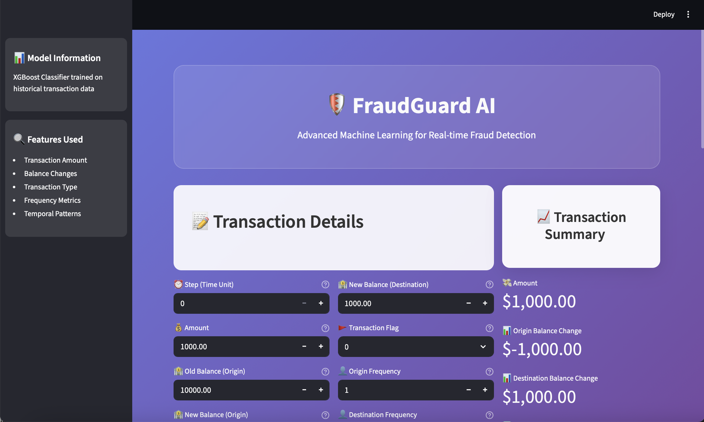

# FraudGuard AI - Advanced Fraud Detection System
## 🛡️ Real-time Machine Learning for Transaction Fraud Detection

### 📌 Project Overview

FraudGuard AI is a sophisticated machine learning system that predicts fraudulent transactions in real-time. Built with XGBoost and deployed via a modern Streamlit web application, it provides instant fraud risk assessment with beautiful visualizations and interactive dashboards.

### 🎨 Modern Interface Features

- **Beautiful Gradient Design**: Modern purple-blue gradient background with glass morphism effects
- **Interactive Dashboard**: Real-time transaction analysis with animated charts
- **Risk Visualization**: Interactive gauge charts showing fraud probability
- **Responsive Design**: Works seamlessly on desktop, tablet, and mobile devices
- **Professional UX**: Intuitive interface with hover effects and smooth animations

### 🔍 Problem Statement

Fraudulent activities can lead to significant financial losses and security risks. FraudGuard AI addresses this by:

- **Real-time Detection**: Instant fraud risk assessment for transactions
- **Advanced Analytics**: Machine learning-powered pattern recognition
- **Visual Insights**: Interactive charts and risk metrics
- **User-Friendly Interface**: Professional dashboard for easy monitoring

## 📸 Screenshots

### Home Dashboard


### Prediction Interface


## 🚀 Features

### Core Functionality
- **Real-time Fraud Detection**: Instant analysis of transaction patterns
- **Probability Scoring**: Detailed fraud risk percentages
- **Interactive Charts**: Animated gauge charts for risk visualization
- **Risk Analysis**: Multiple risk factors assessment
- **Transaction Summary**: Live balance change calculations

### Technical Features
- **XGBoost Model**: High-performance machine learning algorithm
- **Feature Engineering**: Advanced preprocessing and scaling
- **Real-time Processing**: Instant predictions with loading animations
- **Error Handling**: Robust error management and user feedback

### UI/UX Features
- **Modern Design**: Glass morphism with gradient backgrounds
- **Responsive Layout**: Adaptive design for all screen sizes
- **Interactive Elements**: Hover effects and smooth transitions
- **Professional Branding**: Clean, business-ready interface

## 📊 Technologies Used

- **Python** 🐍 - Core programming language
- **Streamlit** - Modern web application framework
- **XGBoost** - High-performance gradient boosting
- **Scikit-learn** - Machine learning utilities
- **Pandas & NumPy** - Data manipulation
- **Plotly** - Interactive visualizations
- **CSS3** - Modern styling and animations

## 🏃‍♂️ How to Run the Project

### Prerequisites
```bash
# Clone the repository
git clone https://github.com/Cngh10/Fraud-Detection-Project.git
cd Fraud-Detection-Project

# Install dependencies
pip install -r requirements.txt
```

### Local Development
```bash
# Run the application
streamlit run app.py

# Access the app at
# http://localhost:8501
```

### Deployment Options

#### 1. Streamlit Cloud (Recommended)
1. Fork this repository
2. Connect to [Streamlit Cloud](https://streamlit.io/cloud)
3. Deploy automatically from GitHub

#### 2. Heroku
```bash
# Create Procfile
echo "web: streamlit run app.py --server.port=\$PORT --server.address=0.0.0.0" > Procfile

# Deploy to Heroku
heroku create your-app-name
git push heroku main
```

#### 3. Docker
```dockerfile
FROM python:3.9-slim
WORKDIR /app
COPY requirements.txt .
RUN pip install -r requirements.txt
COPY . .
EXPOSE 8501
CMD ["streamlit", "run", "app.py", "--server.port=8501", "--server.address=0.0.0.0"]
```

## 📁 Project Structure

```
Fraud-Detection-Project/
├── app.py                          # Main Streamlit application
├── final_xgboost_model.joblib      # Trained XGBoost model
├── Fraud_Analysis_Dataset.csv      # Training dataset
├── FraudDetection.ipynb            # Model training notebook
├── requirements.txt                 # Python dependencies
├── README.md                       # Project documentation
├── description.txt                 # Feature descriptions
└── screenshots/                    # Application screenshots
    ├── home-dashboard.png
    └── prediction.png
```

## 🔧 Model Information

### Features Used
- **Transaction Amount**: Monetary value analysis
- **Balance Changes**: Origin and destination balance variations
- **Transaction Type**: CASH_IN, CASH_OUT, DEBIT, PAYMENT, TRANSFER
- **Frequency Metrics**: Account usage patterns
- **Temporal Patterns**: Time-based transaction analysis

### Model Performance
- **Algorithm**: XGBoost Classifier
- **Training Data**: Historical transaction dataset
- **Features**: 13 engineered features
- **Output**: Fraud probability (0-100%)

## 🎯 Usage Guide

1. **Access the Application**: Open the web interface
2. **Enter Transaction Details**: Fill in all required fields
3. **Review Summary**: Check the transaction summary panel
4. **Predict Risk**: Click "Predict Fraud Risk" button
5. **Analyze Results**: View probability scores and risk metrics
6. **Review Charts**: Examine the interactive gauge chart

## 🤝 Contributing

1. Fork the repository
2. Create a feature branch (`git checkout -b feature/AmazingFeature`)
3. Commit your changes (`git commit -m 'Add some AmazingFeature'`)
4. Push to the branch (`git push origin feature/AmazingFeature`)
5. Open a Pull Request

## 📄 License

This project is licensed under the MIT License - see the [LICENSE](LICENSE) file for details.

## 🙏 Acknowledgments

- **XGBoost Team** for the powerful gradient boosting library
- **Streamlit Team** for the amazing web framework
- **Open Source Community** for various supporting libraries

---

**🛡️ FraudGuard AI** - Protecting transactions with advanced machine learning technology.

*Built with ❤️ using Python, Streamlit, and XGBoost*
